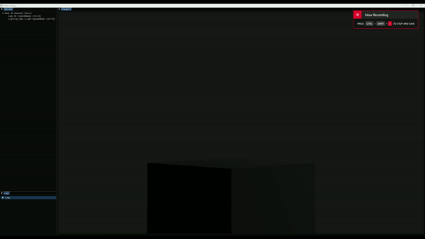

# vector

Vector is a small, work in progress, 2D/3D game engine written in C++. Currently using OpenGL for rendering, but plan to integrate other graphics APIs in the future.

## Features

- 2D/3D rendering
- Scene graph
- Shaders
- Textures
- Camera system
- Phong lighting
- Input handling
- ImGui integration



## Dependencies

To build and run Vector, you will need the following dependencies:

- **Cmake** (Version 3.25 or higher)
- **vcpkg** (For installing dependencies, can be installed through setup.py)
- **C++17** compatible compiler
- **OpenGL** (Version 3.3 or higher)
- **Python** (For running the build script)

## Installation Instructions

### 1. Clone the Repository

```sh
git clone https://github.com/dmcg310/vector.git
cd vector
```

### 2. Install Python Dependencies

Ensure you have Python 3 installed. Then install the required Python packages:

```sh
pip install -r requirements.txt
```

### 3. Run the Setup Script

Run the setup script to install `vcpkg`, install dependencies, and build the project:

```sh
python setup.py
```

The setup script will:
- Ask if `vcpkg` is already installed.
- If not, it will prompt for a directory to install `vcpkg`.
- Install necessary dependencies using `vcpkg`.
- Build the project using CMake.

### 4. Run the Project

After building, navigate to the `vector/build` directory and run the appropriate executable for your platform.

#### MacOS/Linux

```sh
./application/application
```

#### Windows

Debug:

```sh
.\application\Debug\application.exe
```

Release:

```sh
.\application\Release\application.exe
```

## Platform-Specific Notes

### Windows

Ensure that you have the Visual Studio installed.

### MacOS

Ensure that you have the Xcode command line tools installed.

### Linux

Ensure that you have the necessary development packages installed.
You may need to install OpenGL development libraries, e.g. `libgl1-mesa-dev`.

## License

This project is licensed under the MIT License.